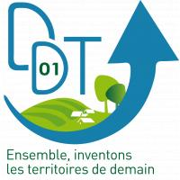

# Bienvenue sur mon portfolio ! - *Welcome !*

## À propos - *About*
Merci de visiter mon portfolio !

***Data Analyst*** avec une forte expérience retail, j’utilise aujourd'hui les données pour aider à prendre de meilleures décisions et apporter une vraie valeur aux projets.

***Mon objectif*** : donner du sens aux chiffres, simplifier ce qui semble complexe, et fournir des analyses claires et des outils visuels qui parlent à tous, du manager à l’opérationnel.

N’hésitez pas à explorer mes projets et à me contacter pour échanger sur des collaborations ou des opportunités. Bonne visite !

- **[LinkedIn](https://www.linkedin.com/in/jpvt33)** 
- **[mailto:@jpvt](mailto:jpvt@outlook.fr)**
- **[CV Pro](https://github.com/jpvt-data/Portfolio/tree/main/donnees/cv/CV%20-%20JP%20Van%20Tongeren%20-%200220252.pdf)**
- **[CV ATS](https://github.com/jpvt-data/Portfolio/tree/main/donnees/cv/CV%20-%20JP%20Van%20Tongeren%20-%20022025.pdf)**

***"Les données nous parlent, mais c’est à nous de les faire chanter."***

____

*Thank you for visiting my portfolio!*

***Data Analyst*** *with solid retail experience, I now use data to help make better decisions and bring real value to projects.*

***My goal***: *Make sense of numbers, simplify the seemingly complex, and provide clear analyses and visual tools that resonate with everyone, from managers to operational staff.*

*Feel free to explore my projects and reach out to discuss collaborations or opportunities. Enjoy !*

***"Data speaks to us, but it's up to us to make it sing."***

---

## 📊 Projets Data - *Projects*
Cette section contient études et projets sur des problématiques spécifiques (réalisations personnelles, projets d'équipe).  

*This section includes studies and projects addressing specific challenges (personal achievements, team projects).*

<table>
  <tr>
    <td width="150">
    
    </td>
    <td>
      <strong><a href="https://github.com/jpvt-data/AlgoCinema/blob/main/README.md">Algorithme Cinéma - "Le 23ème Écran"</a></strong>  
      Projet complet utilisant Machine Learning 🤖, Data Visualisation 📊 et interface web 🌍 pour créer un système intelligent de recommandation de films pour un Cinéma. 
    </td>
  </tr>
  <tr>
    <td width="150">
    
    </td>
    <td>
      <strong><a href="https://github.com/jpvt-data/Etude-Prix-Vin-USA/blob/main/README.md">Étude de Marché du Vin - Domaine des Croix</a></strong>  
      Analyse du marché du vin aux États-Unis pour le <strong>Domaine des Croix</strong>, avec étude des tendances de prix, positionnement concurrentiel et recommandations tarifaires. 
    </td>
  </tr>
  <tr>
    <td width="150">
      
    </td>
    <td>
      <strong><a href="https://github.com/jpvt-data/Market-Price-Retail/tree/main">Market Price Retail</a></strong>  
      Analyse des données retail pour optimiser coûts, profits et stratégie, avec livrables EDA, PowerPoint et tableau de bord Power BI. 
      <em>Retail Data Analysis to optimize costs, profits, and strategy, with EDA, PowerPoint, and Power BI dashboard deliverables.</em>
    </td>
  </tr>
  <tr>
    <td width="150">
      
    </td>
    <td>
      <strong><a href="./donnees/mise_en_pratique/marché-immobilier-ddt-ain/README.md">Observatoire du Marché Immobilier de l'Ain</a></strong>  
      Analyse du marché immobilier de l’Ain via un tableau de bord interactif pour guider les décisions des collectivités et professionnels. 
      <em>Analysis of the real estate market in Ain through an interactive dashboard to support decision-making for local authorities and professionals.</em>
    </td>
  </tr>
  <tr>
    <td width="150">
      
    </td>
    <td>
      <strong><a href="./donnees/mise_en_pratique/business_case/Business-Case-Salaire-Metiers-Data.md">Analyse des métiers Data</a></strong>  
      Exploration des métiers de la data dans le monde pour fournir des recommandations sur l’emplacement d’un nouveau bureau pour un cabinet spécialisé. 
      <em>Exploration of data-related professions worldwide to provide recommendations on the location of a new office for a specialized firm.</em>
    </td>
  </tr>
  <tr>
    <td width="150">
      
    </td>
    <td>
      <strong><a href="https://github.com/jpvt-data/CampusCARE/blob/main/README.md">Projet CampusCARE</a></strong>  
      Analyse des facteurs de dépression chez les étudiants en Inde pour développer des outils de suivi, des stratégies d’intervention précoce et un tableau de bord interactif. 
      <em>Analysis of depression factors among students in India to develop monitoring tools, early intervention strategies, and an interactive dashboard.</em>
    </td>
  </tr>
  <tr>
    <td width="150">
    </td>
    <td>
      <strong><a href="#">Toys & Models</a></strong> <em>à venir</em>  
      Création d'un tableau de bord dynamique pour une entreprise spécialisée dans la vente de modèles et de maquettes. 
      <em>Creation of a dynamic dashboard for a company specializing in the sale of models and figurines.</em>
    </td>
  </tr>
  <tr>
    <td width="150">
    </td>
    <td>
      <strong><a href="https://github.com/jpvt-data/Pokemon-Manager/blob/main/README.md">🎮 Pokémon Manager</a></strong>  
      <em>en développement</em> Création d'une plateforme dédiée à la gestion des collections et à l'optimisation des decks de cartes Pokémon. 
      <em>In development - Creation of a platform dedicated to managing collections and optimizing Pokémon card decks.</em>
    </td>
  </tr>
</table>

- **[Étude de Marché du Vin - Domaine des Croix](https://github.com/jpvt-data/Etude-Prix-Vin-USA/blob/main/README.md)**  
Analyse du marché du vin aux États-Unis pour le **Domaine des Croix**, avec étude des tendances de prix, positionnement concurrentiel et recommandations tarifaires. Résultats livrés sous forme d’EDA, rapport analytique et tableau de bord Power BI.  
*Wine market analysis in the U.S. for **Domaine des Croix**, including price trends, competitive positioning, and pricing recommendations. Deliverables include EDA, analytical report, and Power BI dashboard.*

- **[Market Price Retail](https://github.com/jpvt-data/Market-Price-Retail/tree/main)**  
Analyse des données retail pour optimiser coûts, profits et stratégie, avec livrables EDA, PowerPoint et tableau de bord Power BI.  
*Retail Data Analysis to optimize costs, profits, and strategy, with EDA, PowerPoint, and Power BI dashboard deliverables.*

- **[Observatoire du Marché Immobilier de l'Ain](./donnees/mise_en_pratique/marché-immobilier-ddt-ain/README.md)**  
Analyse du marché immobilier de l’Ain via un tableau de bord interactif pour guider les décisions des collectivités et professionnels.  
*Analysis of the real estate market in Ain through an interactive dashboard to support decision-making for local authorities and professionals.*

- **[Analyse des métiers Data](./donnees/mise_en_pratique/business_case/Business-Case-Salaire-Metiers-Data.md)**  
Exploration des métiers de la data dans le monde pour fournir des recommandations sur l’emplacement d’un nouveau bureau pour un cabinet spécialisé.  
*Exploration of data-related professions worldwide to provide recommendations on the location of a new office for a specialized firm.*

- **[Projet CampusCARE](https://github.com/jpvt-data/CampusCARE/blob/main/README.md)**  
Analyse des facteurs de dépression chez les étudiants en Inde pour développer des outils de suivi, des stratégies d’intervention précoce et un tableau de bord interactif.  
*Analysis of depression factors among students in India to develop monitoring tools, early intervention strategies, and an interactive dashboard.*

- **[Toys & Models]()** ***à venir***   
Création d'un tableau de bord dynamique pour une entreprise spécialisée dans la vente de modèles et de maquettes.  
*Creation of a dynamic dashboard for a company specializing in the sale of models and figurines.*

- **[🎮 Pokémon Manager](https://github.com/jpvt-data/Pokemon-Manager/blob/main/README.md)**  
*en développement* Création d'une plateforme dédiée à la gestion des collections et à l'optimisation des decks de cartes Pokémon.  
*In development - Creation of a platform dedicated to managing collections and optimizing Pokémon card decks.*

---

## 🧩 Exercices Techniques - *technical exercises*
Application de techniques spécifiques pour résoudre des problématiques données.  
*Applying specific techniques to solve given problems.*

- [**Machine Learning**](./donnees/mise_en_pratique/machine_learning/machine_learning.md)
- [**Web Scraping**](./donnees/mise_en_pratique/web_scraping/web_scraping.md)

---

## **🛠️ Outils-Tech** - *Tech-Tools*
Ce [dépôt](https://github.com/jpvt-data/Outils-Tech/blob/main/README.md) regroupe une série de fiches pratiques que j’utilise au quotidien pour mes projets Data.

*This repository contains a series of practical guides I use daily for my data projects.*

---

## 💻 Compétences techniques - *Technical Skills* 
  
- 🖥️ Python, SQL  
- 📊 Power BI, Tableau, Matplotlib, Seaborn, Plotly, Folium 
- 🔄 Pandas, NumPy  
- 💾 MySQL, DBeaver, PostgreSQL
- 🤖 Scikit-learn
- 🔧 Git, Jupyter Notebook, VSCode, Excel

---

**Merci de votre visite !**

</body>
</html>

*Thank you for your visit!*

