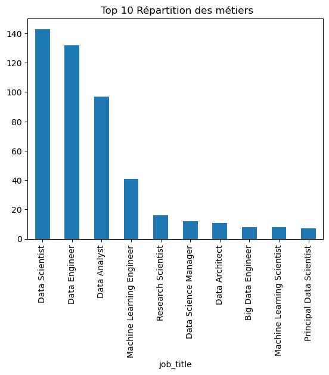
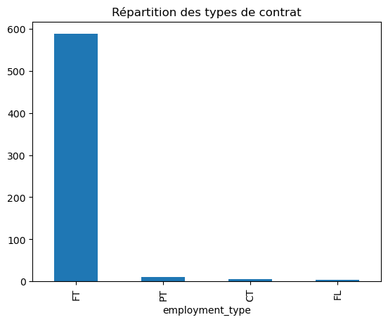
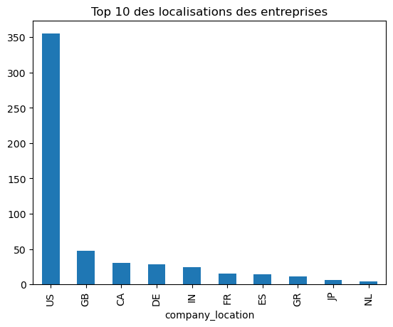

[⬅ Page Précédente](./business_case.md)

# Business Case : Salaire dans les métiers de la data

## Introduction
Dans cette analyse, nous avons exploré les salaires des métiers dans le domaine de la **data** pour fournir des recommandations sur l’emplacement d’un nouveau bureau pour un cabinet spécialisé dans les métiers de la **data**.

En tant que **Data Analyst**, nous avons utilisé des données provenant de différents profils d’emploi pour proposer des insights clairs sur les tendances salariales et les choix de localisations les plus intéressants.

---

## Objectifs

L'objectif de cette analyse est de répondre aux questions suivantes :

- Quels profils privilégier pour l'implantation d'un nouveau bureau ?
- Quelle est la tendance salariale dans les métiers de la data ?
- Quelles recommandations peuvent être faites pour la prise de décision stratégique sur la localisation du futur bureau ?

---

## Plan de résolution

### **1. Exploration et Nettoyage des données**

#### **1.1 Chargement des données**


```python
import pandas as pd

# Charger le dataset
url = "https://raw.githubusercontent.com/WildCodeSchool/data-training-resources/refs/heads/main/datasets/ds_salaries%20-%20Vanilla.csv"
df = pd.read_csv(url)
```

#### **1.2 Description des données**


```python
df.head()
```


<div>
<table border="1" class="dataframe">
  <thead>
    <tr style="text-align: right;">
      <th></th>
      <th>Unnamed: 0</th>
      <th>work_year</th>
      <th>experience_level</th>
      <th>employment_type</th>
      <th>job_title</th>
      <th>salary</th>
      <th>salary_currency</th>
      <th>salary_in_usd</th>
      <th>employee_residence</th>
      <th>remote_ratio</th>
      <th>company_location</th>
      <th>company_size</th>
    </tr>
  </thead>
  <tbody>
    <tr>
      <th>0</th>
      <td>0</td>
      <td>2020</td>
      <td>MI</td>
      <td>FT</td>
      <td>Data Scientist</td>
      <td>70000</td>
      <td>EUR</td>
      <td>79833</td>
      <td>DE</td>
      <td>0</td>
      <td>DE</td>
      <td>L</td>
    </tr>
    <tr>
      <th>1</th>
      <td>1</td>
      <td>2020</td>
      <td>SE</td>
      <td>FT</td>
      <td>Machine Learning Scientist</td>
      <td>260000</td>
      <td>USD</td>
      <td>260000</td>
      <td>JP</td>
      <td>0</td>
      <td>JP</td>
      <td>S</td>
    </tr>
    <tr>
      <th>2</th>
      <td>2</td>
      <td>2020</td>
      <td>SE</td>
      <td>FT</td>
      <td>Big Data Engineer</td>
      <td>85000</td>
      <td>GBP</td>
      <td>109024</td>
      <td>GB</td>
      <td>50</td>
      <td>GB</td>
      <td>M</td>
    </tr>
    <tr>
      <th>3</th>
      <td>3</td>
      <td>2020</td>
      <td>MI</td>
      <td>FT</td>
      <td>Product Data Analyst</td>
      <td>20000</td>
      <td>USD</td>
      <td>20000</td>
      <td>HN</td>
      <td>0</td>
      <td>HN</td>
      <td>S</td>
    </tr>
    <tr>
      <th>4</th>
      <td>4</td>
      <td>2020</td>
      <td>SE</td>
      <td>FT</td>
      <td>Machine Learning Engineer</td>
      <td>150000</td>
      <td>USD</td>
      <td>150000</td>
      <td>US</td>
      <td>50</td>
      <td>US</td>
      <td>L</td>
    </tr>
  </tbody>
</table>
</div>


```python
df.info()
```

    <class 'pandas.core.frame.DataFrame'>
    RangeIndex: 607 entries, 0 to 606
    Data columns (total 12 columns):
     #   Column              Non-Null Count  Dtype 
    ---  ------              --------------  ----- 
     0   Unnamed: 0          607 non-null    int64 
     1   work_year           607 non-null    int64 
     2   experience_level    607 non-null    object
     3   employment_type     607 non-null    object
     4   job_title           607 non-null    object
     5   salary              607 non-null    int64 
     6   salary_currency     607 non-null    object
     7   salary_in_usd       607 non-null    int64 
     8   employee_residence  607 non-null    object
     9   remote_ratio        607 non-null    int64 
     10  company_location    607 non-null    object
     11  company_size        607 non-null    object
    dtypes: int64(5), object(7)
    memory usage: 57.0+ KB
    


```python
df.describe()
```


<div>
<table border="1" class="dataframe">
  <thead>
    <tr style="text-align: right;">
      <th></th>
      <th>Unnamed: 0</th>
      <th>work_year</th>
      <th>salary</th>
      <th>salary_in_usd</th>
      <th>remote_ratio</th>
    </tr>
  </thead>
  <tbody>
    <tr>
      <th>count</th>
      <td>607.000000</td>
      <td>607.000000</td>
      <td>6.070000e+02</td>
      <td>607.000000</td>
      <td>607.00000</td>
    </tr>
    <tr>
      <th>mean</th>
      <td>303.000000</td>
      <td>2021.405272</td>
      <td>3.240001e+05</td>
      <td>112297.869852</td>
      <td>70.92257</td>
    </tr>
    <tr>
      <th>std</th>
      <td>175.370085</td>
      <td>0.692133</td>
      <td>1.544357e+06</td>
      <td>70957.259411</td>
      <td>40.70913</td>
    </tr>
    <tr>
      <th>min</th>
      <td>0.000000</td>
      <td>2020.000000</td>
      <td>4.000000e+03</td>
      <td>2859.000000</td>
      <td>0.00000</td>
    </tr>
    <tr>
      <th>25%</th>
      <td>151.500000</td>
      <td>2021.000000</td>
      <td>7.000000e+04</td>
      <td>62726.000000</td>
      <td>50.00000</td>
    </tr>
    <tr>
      <th>50%</th>
      <td>303.000000</td>
      <td>2022.000000</td>
      <td>1.150000e+05</td>
      <td>101570.000000</td>
      <td>100.00000</td>
    </tr>
    <tr>
      <th>75%</th>
      <td>454.500000</td>
      <td>2022.000000</td>
      <td>1.650000e+05</td>
      <td>150000.000000</td>
      <td>100.00000</td>
    </tr>
    <tr>
      <th>max</th>
      <td>606.000000</td>
      <td>2022.000000</td>
      <td>3.040000e+07</td>
      <td>600000.000000</td>
      <td>100.00000</td>
    </tr>
  </tbody>
</table>
</div>


```python
# Vérifier les valeurs manquantes
df.isnull().sum()
```


    Unnamed: 0            0
    work_year             0
    experience_level      0
    employment_type       0
    job_title             0
    salary                0
    salary_currency       0
    salary_in_usd         0
    employee_residence    0
    remote_ratio          0
    company_location      0
    company_size          0
    dtype: int64


```python
# Supprimer les doublons
df = df.drop_duplicates()
```

Voici les premières informations du dataset après avoir le chargement et une première exploration des données :

- Il y a un total de 607 enregistrements dans le dataset.
- Aucune valeur manquante
- Les doublons éventuels ont été supprimés.

##### **Description des variables**

1. **`Unnamed: 0`** : Index ou identifiant de la ligne, à supprimer.
2. **`work_year`** : Année de l'observation, utile pour analyser les tendances temporelles des salaires.
3. **`experience_level`** : Niveau d'expérience (Junior, Mid-Level, Senior, ***abréviations***)), permet de comparer les salaires selon l'expérience.
4. **`employment_type`** : Type de contrat (CDI, CDD, Freelance, ***abréviations anglaises***) important pour analyser l'impact du statut sur les salaires.
5. **`job_title`** : Intitulé du poste (Data Analyst, Data Scientist, etc.), essentiel pour comparer les salaires entre les différents métiers.
6. **`salary`** : Salaire brut annuel (devise locale), variable principale de l'analyse.
7. **`salary_currency`** : Devise du salaire (***abréviation devise***), utile pour les conversions monétaires.
8. **`salary_in_usd`** : Salaire en USD (***US Dollars***), standardisé pour les comparaisons internationales.
9. **`employee_residence`** : Localisation de l'employé (***abréviation pays***), aide à analyser l'impact géographique sur les salaires.
10. **`remote_ratio`** : Ratio de télétravail (***en %***), permet d'examiner l'impact du télétravail sur les salaires.
11. **`company_location`** : Localisation de l'entreprise (***abréviation pays***), utile pour l'analyse géographique des salaires.
12. **`company_size`** : Taille de l'entreprise (***Small, Medium, Large***), permet d'analyser l'impact de la taille de l'entreprise sur les salaires.

##### **Variables principales pour l'analyse :**
- **`work_year`**
- **`experience_level`**
- **`employment_type`**
- **`job_title`**
- **`salary_in_usd`**
- **`remote_ratio`**
- **`company_location`**
- **`company_size`**

#### **1.3 Analyse préliminaire**


```python
# Répartition des métiers
df['job_title'].value_counts().head(10).plot(kind='bar', title=' Top 10 Répartition des métiers')

```


    <Axes: title={'center': ' Top 10 Répartition des métiers'}, xlabel='job_title'>


    

    


```python
# Répartition des types de contrat
df['employment_type'].value_counts().plot(kind='bar', title='Répartition des types de contrat')
```


    <Axes: title={'center': 'Répartition des types de contrat'}, xlabel='employment_type'>


    

    


**Signification des abréviations** :

- **FT** : Full-Time (CDI Temps plein)
- **PT** : Part-Time (CDI Temps partiel)
- **CT** : Contract (CDD)
- **FL** : Freelance


```python
# Répartition des niveaux d'expérience
df['experience_level'].value_counts().plot(kind='bar', title="Répartition des niveaux d'expérience")
```


    <Axes: title={'center': "Répartition des niveaux d'expérience"}, xlabel='experience_level'>


    

    


**Signification des abréviations** :

- **EX** : Executive (Poste de direction)
- **SE** : Senior
- **MI** : Niveau Intermédiaire
- **EN** : Junior - Débutant


```python
# Répartition de la taille des entreprises
df['company_size'].value_counts().plot(kind='bar', title='Répartition de la taille des entreprises')
```


    <Axes: title={'center': 'Répartition de la taille des entreprises'}, xlabel='company_size'>


    

    


```python
# Répartition géographique
df['company_location'].value_counts().head(10).plot(kind='bar', title='Top 10 des localisations des entreprises')
```


    <Axes: title={'center': 'Top 10 des localisations des entreprises'}, xlabel='company_location'>


    

    


##### **Conclusion Analyse Préliminaire :**

Nous avons exploré plusieurs dimensions du dataset pour en tirer des informations clés. Voici les résultats des principales analyses :

- **Répartition des métiers** : Nous avons observé que les postes les plus fréquents sont **Data Scientist, Data Engineer et Data Analyst**.

- **Répartition des contrats** : Les contrats CDI sont largement dominants.

- **Répartition de la taille des entreprises** : Les entreprises de taille moyenne sont les plus nombreuses. (***M = L + S environ***)

- **Répartition géographique** : Les entreprises sont majoritairement situées aux ***Etats Unis, puis Grande Bretagne, Canada, Allemagne, Inde***.

#### **1.4 Préparation du DataFrame**

Pour rendre le dataset plus clair, plus accessible en vue de l'analyse PowerBi ; nous allons attribuer des noms clairs et compréhensibles en français.

##### **1.4.1 Intitulé des Colonnes**


```python
# Renommer les colonnes
df.rename(columns={
    'Unnamed: 0': 'id',
    'work_year': 'année',
    'experience_level': 'niveau_experience',
    'employment_type': 'type_contrat',
    'job_title': 'intitulé_poste',
    'salary': 'salaire',
    'salary_currency': 'devise_salaire',
    'salary_in_usd': 'salaire_usd',
    'employee_residence': 'résidence_employé',
    'remote_ratio': 'télétravail_ratio',
    'company_location': 'localisation_entreprise',
    'company_size': 'taille_entreprise'
}, inplace=True)
```


```python
# Supprimer les colonnes inutiles
df.drop(columns=['id', 'salaire', 'devise_salaire', 'résidence_employé'], inplace=True)
```


```python
df.rename(columns={'salaire_usd' : 'salaire'}, inplace=True)
```

##### **1.4.2 Remplacement des valeurs**


```python
# Niveau d'expérience
df['niveau_experience'] = df['niveau_experience'].replace({
    'SE': 'Sénior',
    'MI': 'Intermédiaire',
    'EN': 'Junior',
    'EX': 'Expert'
})
```


```python
# Type de contrat
df['type_contrat'] = df['type_contrat'].replace({
    'FT': 'CDI Temps plein',
    'PT': 'CDI Temps partiel',
    'CT': 'CDD',
    'FL': 'Freelance'
})
```


```python
df.sample(5)
```


<div>
<table border="1" class="dataframe">
  <thead>
    <tr style="text-align: right;">
      <th></th>
      <th>année</th>
      <th>niveau_experience</th>
      <th>type_contrat</th>
      <th>intitulé_poste</th>
      <th>salaire</th>
      <th>télétravail_ratio</th>
      <th>localisation_entreprise</th>
      <th>taille_entreprise</th>
    </tr>
  </thead>
  <tbody>
    <tr>
      <th>473</th>
      <td>2022</td>
      <td>Sénior</td>
      <td>CDI Temps plein</td>
      <td>Data Scientist</td>
      <td>140000</td>
      <td>100</td>
      <td>US</td>
      <td>M</td>
    </tr>
    <tr>
      <th>588</th>
      <td>2022</td>
      <td>Sénior</td>
      <td>CDI Temps plein</td>
      <td>Data Analyst</td>
      <td>99000</td>
      <td>0</td>
      <td>US</td>
      <td>M</td>
    </tr>
    <tr>
      <th>462</th>
      <td>2022</td>
      <td>Intermédiaire</td>
      <td>CDI Temps partiel</td>
      <td>Data Engineer</td>
      <td>54957</td>
      <td>50</td>
      <td>DE</td>
      <td>L</td>
    </tr>
    <tr>
      <th>50</th>
      <td>2020</td>
      <td>Junior</td>
      <td>CDI Temps plein</td>
      <td>Data Analyst</td>
      <td>6072</td>
      <td>0</td>
      <td>IN</td>
      <td>S</td>
    </tr>
    <tr>
      <th>484</th>
      <td>2022</td>
      <td>Sénior</td>
      <td>CDI Temps plein</td>
      <td>Data Engineer</td>
      <td>210000</td>
      <td>100</td>
      <td>US</td>
      <td>M</td>
    </tr>
  </tbody>
</table>
</div>


##### **1.4.3 Export du DataFrame pour l'utilisation PowerBi**


```python
# Réinitialiser les index
df.reset_index(drop=True, inplace=True)

# Exporter en CSV
df.to_csv('salaire_metiers_data.csv', index=False, encoding='utf-8')
```


[⬅ Page Précédente](./business_case.md)
